<a href="https://github.com/Pafos1k">
  

</a>
 

 

 

<h2 

  

 

<table>
<tr>

<td width="50%" align="center" valign="middle">

<picture>
  
</picture>

</td>

</tr>
</table>

<picture>
  <source media="(prefers-color-scheme: dark)"  srcset="https://raw.githubusercontent.com/gargibhardwaj24/gargibhardwaj24/output/snake-dark.svg">
  <source media="(prefers-color-scheme: light)" srcset="https://raw.githubusercontent.com/gargibhardwaj24/gargibhardwaj24/output/snake.svg">
  
</picture>

